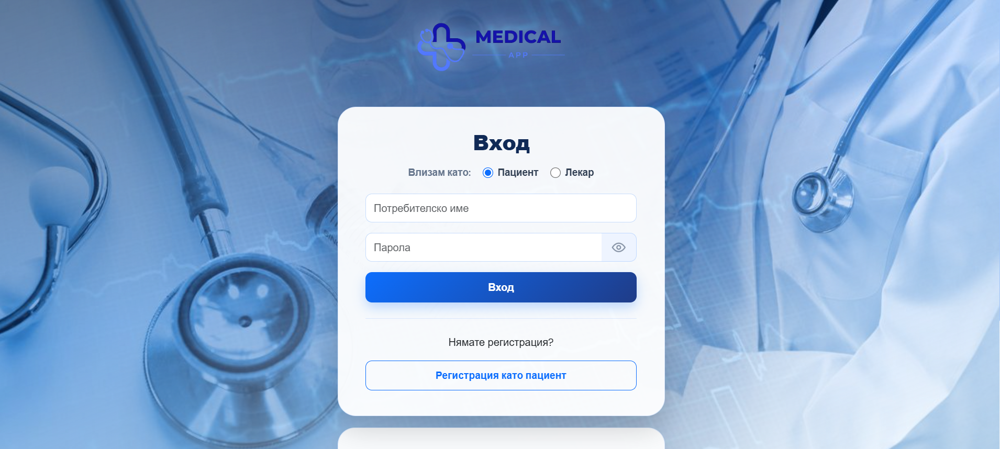
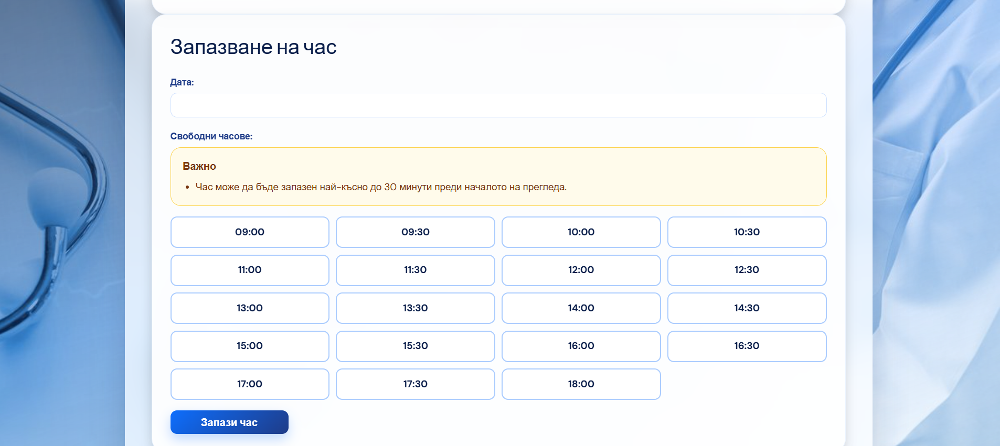

# Medical Appointment Booking System

Medical Appointment Booking System is a web application designed to simplify the process of finding doctors and booking medical appointments.
The system allows patients to create an account, browse doctor profiles, book appointments, manage their personal information, and review their scheduled or cancelled appointments. Doctors can register, manage their profiles, and view appointment information through a dedicated dashboard.

## Project Purpose

This project was developed as part of my university studies in Computer and Software Engineering. Its purpose is to demonstrate my skills in web development, backend programming, database management, and user interface design.

## Screenshots

Screenshots of the main pages of the application are included below.

### Login Page

### Doctor Search Page

### Appointment Booking Page

